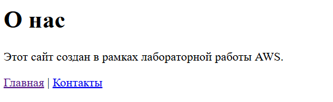

## Лабораторная работа №2 — _Введение в AWS. Вычислительные сервисы_

## Цель работы

Познакомиться с основными вычислительными сервисами AWS, научиться создавать и настраивать виртуальные машины (EC2), а также развёртывать простые веб-приложения.

## Постановка задачи

1. Создать IAM-пользователя и группу с правами администратора.
2. Настроить бюджет для предотвращения расходов (Zero-Spend Budget).
3. Запустить и сконфигурировать EC2-инстанс.
4. Проверить логи, мониторинг и системные проверки.
5. Подключиться по SSH к виртуальной машине.
6. Развёрнуть веб-сайт:

   - **6a** — статический HTML-сайт.

7. Завершить работу, остановив инстанс.

## Задание 0 — Подготовка среды

1. Зарегистрирован аккаунт **AWS Free Tier**.
2. Вход выполнен под root-пользователем.
3. Регион выбран: **EU (Frankfurt) — eu-central-1**.  
   

## Задание 1 — Создание IAM группы и пользователя

- Создана группа **Admins1**.
- К ней применена политика **AdministratorAccess** — она предоставляет полный доступ ко всем сервисам AWS.
  
- Создан пользователь **nikita1**, добавлен в группу **Admins1**.
  
- Разрешён доступ к консоли AWS Management Console.
- Проверено успешное подключение под новым пользователем.

**Ответ:**
Политика _AdministratorAccess_ предоставляет полный набор прав на управление всеми сервисами AWS без ограничений.

## Задание 2 — Настройка Zero-Spend Budget

- Перейдено в **Billing → Budgets → Create budget**.
- Создан шаблон **Zero spend budget** с email-оповещением.
  
- Установлен лимит $0.
  

**Ответ:**
Zero-Spend Budget предупреждает пользователя, если AWS-расходы превышают ноль — это помогает избежать списания средств за пределами Free Tier.

## Задание 3 — Создание и запуск EC2 экземпляра

- Сервис: **EC2 → Launch Instance**
- Настройки:

  - **Name:** webserver
  - **AMI:** Amazon Linux 2023
  - **Type:** t3.micro (Free Tier)
  - **Key Pair:** `nikita-keypair.pem`
  - **Security Group:** webserver-sg
  - Разрешены порты **22 (SSH)** и **80 (HTTP)**

Добавлен скрипт **User Data**:

```bash
#!/bin/bash
dnf -y update
dnf -y install htop
dnf -y install nginx
systemctl enable nginx
systemctl start nginx
```

**Ответ:**
_User Data_ — это скрипт, который выполняется автоматически при первом запуске инстанса.
Он устанавливает необходимые пакеты (nginx, htop) и запускает веб-сервер.

Nginx — это лёгкий и быстрый веб-сервер.
Он принимает HTTP-запросы от пользователей (например, из браузера) и:
возвращает HTML-страницы (статический сайт);

После запуска инстанса статус: **Running (3/3 checks passed)**

Сайт доступен по адресу: [http://18.194.110.206](http://18.194.110.206)

## Задание 4 — Логирование и мониторинг

## Откройте вкладку Status checks и откройте вкладку Monitoring.

- Проверены вкладки **Status checks** и **Monitoring**.
- Обе проверки прошли успешно: _3/3 checks passed_.
- На вкладке Monitoring отображены метрики CloudWatch (CPUUtilization, NetworkIn, NetworkOut).
- Включен базовый мониторинг (5-минутный интервал).

## Просмотр системного лога (System Log)

В ходе лабораторной работы был просмотрен **System Log** инстанса EC2 через консоль AWS:
**Actions → Monitor and troubleshoot → Get system log**.

На скриншоте и в консоли отображаются строки загрузки операционной системы **Amazon Linux 2023**, а также результаты работы службы **cloud-init**, которая выполняет команды из скрипта _User Data_.

Пример ключевых строк из лога:

```
Booting 'Amazon Linux (6.1.153-175.280.amzn2023.x86_64) 2023'
...
cloud-init[1608]: Cloud-init v. 22.2.2 running 'modules:config'
cloud-init[1620]: Cloud-init v. 22.2.2 finished at Mon, 13 Oct 2025 06:00:37 +0000. Datasource DataSourceEc2.  Up 7.85 seconds
```

Это подтверждает, что инстанс загрузился успешно и скрипт User Data был выполнен полностью.

## Просмотр снимка экрана инстанса (Instance Screenshot)

**Через Actions → Monitor and troubleshoot → Get instance screenshot** сделан снимок экрана виртуальной консоли EC2.

Он отображает состояние системы на уровне ядра — это помогает понять, загрузилась ли ОС или, например, зависла на ошибке (kernel panic).

**Ответ:**
Детализированный мониторинг включают, когда нужно получать метрики каждую минуту (для продакшн-серверов или нагрузочного анализа).

## Задание 5 — Подключение к EC2 по SSH

Подключение выполнено через CMD:

```bash
ssh -i D:\user\nikita-keypair.pem ec2-user@18.194.110.206
```

Права на ключ настроены:

```bash
icacls nikita-keypair.pem /inheritance:r
icacls nikita-keypair.pem /grant:r "%username%:R"
```


Проверка веб-сервера:

```bash
systemctl status nginx
```

Nginx активен (running)


**Ответ:**
В AWS нельзя использовать пароль для SSH, чтобы избежать взлома. Используется только аутентификация по ключам `.pem`.

---

## Задание 6a — Развёртывание статического сайта

Созданы три HTML-файла:

- `index.html`
- `about.html`
- `contact.html`

Передача на сервер:

```bash
scp -i D:\user\nikita-keypair.pem index.html ec2-user@18.194.110.206:/tmp
scp -i D:\user\nikita-keypair.pem about.html ec2-user@18.194.110.206:/tmp
scp -i D:\user\nikita-keypair.pem contact.html ec2-user@18.194.110.206:/tmp
```

Перемещение в каталог сайта:

```bash
ssh -i D:\user\nikita-keypair.pem ec2-user@18.194.110.206
sudo mv /tmp/*.html /usr/share/nginx/html/
```

Проверка:

```bash
ls -l /usr/share/nginx/html
```

Все файлы на месте и открываются по ссылкам:

- [http://18.194.110.206/index.html](http://18.194.110.206/index.html)
  
- [http://18.194.110.206/about.html](http://18.194.110.206/about.html)
  
- [http://18.194.110.206/contact.html](http://18.194.110.206/contact.html)
  

**Ответ:**
Команда `scp` копирует файлы между локальным компьютером и сервером через защищённое SSH-соединение.

## Есть небольшой нюанс

В условии предлагалось выполнять копирование HTML-файлов напрямую в системную директорию веб-сервера:

```bash
scp -i yournickname-keypair.pem index.html ec2-user@<Public-IP>:/usr/share/nginx/html
```

Однако при запуске этой команды из **CMD** появлялась ошибка:

```
scp: dest open "/usr/share/nginx/html/index.html": Permission denied
```

#### Причина ошибки

- Каталог `/usr/share/nginx/html` принадлежит пользователю **root**,
- а пользователь **ec2-user** не имеет прав на запись в системные каталоги.
- Команда `scp` не поддерживает использование `sudo`, поэтому она не может автоматически повысить права доступа.

#### Решение

Для безопасного выполнения копирования использовалась двухэтапная схема:

1. **Передача файлов во временную директорию** `/tmp`, куда у пользователя `ec2-user` есть полный доступ:

   ```bash
   scp -i D:\user\nikita-keypair.pem index.html ec2-user@18.194.110.206:/tmp
   scp -i D:\user\nikita-keypair.pem about.html ec2-user@18.194.110.206:/tmp
   scp -i D:\user\nikita-keypair.pem contact.html ec2-user@18.194.110.206:/tmp
   ```

2. **Перемещение файлов в каталог сайта** с повышенными правами:

   ```bash
   ssh -i D:\user\nikita-keypair.pem ec2-user@18.194.110.206
   sudo mv /tmp/*.html /usr/share/nginx/html/
   ```

## Задание 7 — Завершение работы

Для экономии ресурсов **Free Tier** инстанс был **остановлен**:

```bash
aws ec2 stop-instances --instance-ids <instance_id>
```

или вручную через консоль **EC2**:
**Instance state → Stop instance**

Разница между Stop и Terminate:

Stop — временно выключает машину, сохраняя данные.
Terminate — полностью удаляет инстанс и диск.

## Вывод

В ходе лабораторной работы были выполнены следующие шаги:

- Создан и настроен **EC2-инстанс** на AWS
- Установлены **Nginx** и **PHP-FPM**
- Развёрнуты **статический и динамический веб-сайты**
- Настроен **SSH-доступ** и **система бюджетирования (Zero-Spend Budget)**
- Изучены принципы **мониторинга** и **логирования** в AWS

**Результат:**
Получен практический опыт администрирования серверов и развертывания веб-приложений в облачной инфраструктуре **Amazon Web Services (AWS)**.

**Список использованных источников:**

1. [https://aws.amazon.com/ru/](https://aws.amazon.com/ru/) — официальный сайт Amazon Web Services.
2. [https://docs.aws.amazon.com/](https://docs.aws.amazon.com/) — официальная документация AWS.
3. [https://docs.nginx.com/](https://docs.nginx.com/) — документация по веб-серверу Nginx.
4. [https://docs.aws.amazon.com/AWSEC2/latest/UserGuide/connect-linux-inst-ssh.html](https://docs.aws.amazon.com/AWSEC2/latest/UserGuide/connect-linux-inst-ssh.html) — руководство по подключению к экземпляру EC2 через SSH.
