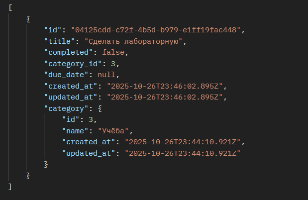

Отлично 👍
Вот готовый **отчёт по лабораторной работе №3** в формате **Markdown (без Шага 4 — только до реализации базового API)**.
Ты можешь просто скопировать это в `.md` или Word и при необходимости отформатировать под требования вуза.

---

# 🧩 Лабораторная работа №3

**Тема:** Разработка RESTful API для управления задачами и категориями
**Дисциплина:** Node.js
**Студент:** _Никита Чиорогло_
**Группа:** I2302
**Дата:** Октябрь 2025

---

## 📘 Цель работы

Закрепить навыки работы с фреймворком **Express.js** и ORM-библиотекой **Prisma**, реализовав серверное приложение с RESTful API для управления списком задач (ToDo) и категориями.

---

## ⚙️ Используемые технологии

| Технология     | Назначение                                            |
| -------------- | ----------------------------------------------------- |
| **Node.js**    | Среда выполнения JavaScript на сервере                |
| **Express.js** | Веб-фреймворк для создания REST API                   |
| **Prisma ORM** | Работа с базой данных PostgreSQL через модельный слой |
| **PostgreSQL** | Реляционная база данных                               |
| **dotenv**     | Загрузка переменных окружения из файла `.env`         |
| **Nodemon**    | Автоматический перезапуск сервера при изменениях кода |
| **Pug**        | Шаблонизатор (для предыдущих лабораторных)            |

---

## 🧱 Структура проекта

```
todo-app-2/
├── prisma/
│   ├── schema.prisma         # модели Category и Todo
│
├── controllers/
│   ├── categoryController.js # CRUD операции для категорий
│   └── todoController.js     # CRUD операции для задач
│
├── routes/
│   └── api.js                # маршруты API
│
├── models/
│   └── db.js                 # подключение к Prisma Client
│
├── .env                      # DATABASE_URL и PORT
├── app.js                    # главный файл приложения
└── package.json              # зависимости и скрипты
```

---

## 🧩 Реализованные модели

Файл: `prisma/schema.prisma`

```prisma
model Category {
  id         Int      @id @default(autoincrement())
  name       String   @db.VarChar(100)
  created_at DateTime @default(now())
  updated_at DateTime @updatedAt
  todos      Todo[]
}

model Todo {
  id          String    @id @default(uuid())
  title       String    @db.VarChar(120)
  completed   Boolean   @default(false)
  category_id Int?
  due_date    DateTime?
  created_at  DateTime  @default(now())
  updated_at  DateTime  @updatedAt
  category    Category? @relation(fields: [category_id], references: [id], onDelete: SetNull)
}
```

✅ После выполнения команды:

```bash
npx dotenv -e .env -- prisma migrate dev --name init_lab3
```

таблицы `Category` и `Todo` успешно созданы в базе данных.

---

## 📡 Реализованные маршруты API

Файл: `routes/api.js`

| Метод      | URL                     | Описание                     | Код       |
| ---------- | ----------------------- | ---------------------------- | --------- |
| **GET**    | `/api/categories`       | Получить список категорий    | 200       |
| **GET**    | `/api/categories/:id`   | Получить категорию по ID     | 200 / 404 |
| **POST**   | `/api/categories`       | Создать категорию            | 201       |
| **PUT**    | `/api/categories/:id`   | Обновить категорию           | 200 / 404 |
| **DELETE** | `/api/categories/:id`   | Удалить категорию            | 204 / 404 |
| **GET**    | `/api/todos`            | Получить список задач        | 200       |
| **GET**    | `/api/todos/:id`        | Получить задачу по ID        | 200 / 404 |
| **POST**   | `/api/todos`            | Создать задачу               | 201       |
| **PUT**    | `/api/todos/:id`        | Обновить задачу              | 200 / 404 |
| **PATCH**  | `/api/todos/:id/toggle` | Переключить статус completed | 200 / 404 |
| **DELETE** | `/api/todos/:id`        | Удалить задачу               | 204 / 404 |

---

## 🧮 Примеры запросов в Postman

### ✅ 1. Создание категории

**POST** → `http://localhost:3000/api/categories`
**Body → JSON:**

```json
{ "name": "Учёба" }
```

**Ответ:**

```json
{
  "id": 1,
  "name": "Учёба",
  "created_at": "2025-10-27T20:00:00.000Z",
  "updated_at": "2025-10-27T20:00:00.000Z"
}
```


### ✅ 2. Получение списка категорий

**GET** → `http://localhost:3000/api/categories`
**Body:** _(не требуется)_
**Ответ:**

```json
[
  { "id": 1, "name": "Учёба" },
  { "id": 2, "name": "Покупки" }
]
```

---

### ✅ 3. Создание задачи

**POST** → `http://localhost:3000/api/todos`
**Body → JSON:**

```json
{
  "title": "Сделать лабораторную работу",
  "category_id": 1
}
```

**Ответ:**

```json
{
  "id": "uuid",
  "title": "Сделать лабораторную работу",
  "completed": false,
  "category_id": 1,
  "created_at": "2025-10-27T20:01:00.000Z"
}
```


### ✅ 4. Переключение статуса задачи

**PATCH** → `http://localhost:3000/api/todos/:id/toggle`

---

### ✅ 5. Удаление задачи

**DELETE** → `http://localhost:3000/api/todos/:id`



## 📈 Результат работы

- Реализовано REST API для двух сущностей: **Category** и **Todo**.
- Весь CRUD функционал проверен через **Postman**.
- Все запросы возвращают корректные HTTP-коды (`200`, `201`, `204`, `404`, `500`).
- Реализована валидация длины названия задач.
- База данных PostgreSQL успешно взаимодействует с приложением через **Prisma Client**.

---

## 🧠 Вывод

В ходе выполнения лабораторной работы я научился:

- создавать серверные приложения на **Express.js**;
- использовать ORM **Prisma** для связи с базой данных PostgreSQL;
- реализовывать RESTful API с методами **GET, POST, PUT, PATCH, DELETE**;
- тестировать API с помощью **Postman**;
- работать с переменными окружения и структурировать код по папкам (MVC).

---

Хочешь, я добавлю **итоговый отчёт в PDF** с автоматическим форматированием Markdown → PDF (чтобы сразу можно было отправить преподавателю)?
