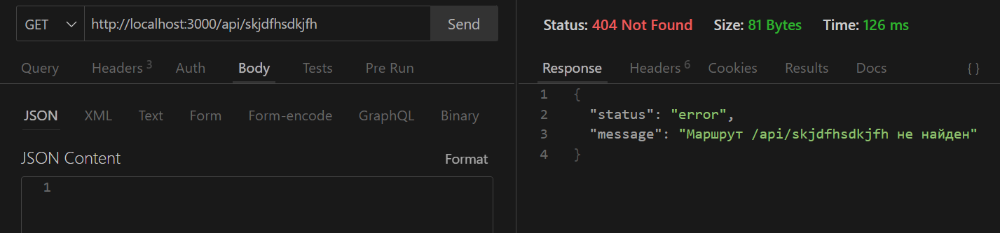
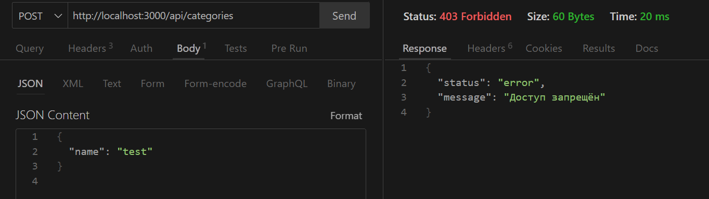
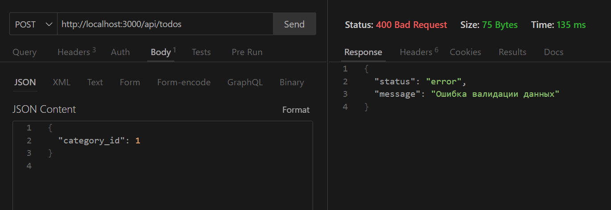
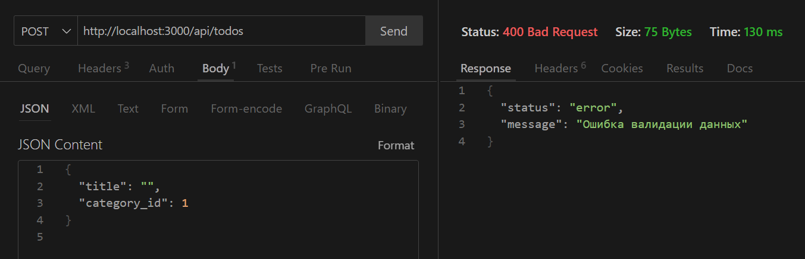
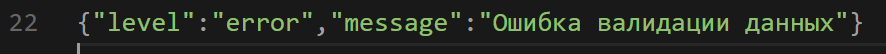
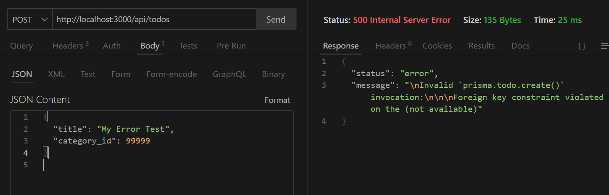

# Лабораторная работа №4. Обработка ошибок, валидация и логгирование

> Продолжите разработку приложения из предыдущей лабораторной работы (№3).

## Цель работы

Целью данной лабораторной работы является изучение методов обработки ошибок, валидации данных и логгирования в приложениях на Node.JS с использованием Express.

### Шаг 1. Обработка ошибок

### Зачем она нужна?

В Express можно обрабатывать ошибки в каждом маршруте, но это приводит к хаосу:
часть ошибок отображается по одному, часть по другому.

Централизованный обработчик позволяет:

- иметь один формат ошибки;
- сократить код в контроллерах;
- перехватывать ошибки даже внутри асинхронных функций;
- легко отправлять ошибки в лог или на сторонние сервисы.

### Что было сделано?

1. Создан единый обработчик ошибок в конце `app.js`.

2. Добавлен механизм «пользовательских ошибок» — например:

   - ошибка валидации,
   - ошибка доступа,
   - ошибка “ресурс не найден”.

3. Если маршрут не найден — возвращается ошибка 404 в едином формате.

### Проверка Шага 1 (Thunder Client)

1.  **Маршрут не существует**



2.  **Обычный пользователь пытается создать категорию**



3.  **Получение несуществующей задачи**



### Шаг 2. Валидация данных

# **2.1. Что было сделано**

1. **На все маршруты, которые принимают данные**, добавлена валидация.
   Это маршруты:

   - регистрация /auth/register
   - авторизация /auth/login
   - создание категории
   - обновление категории
   - создание задачи
   - обновление задачи

2. Проверяются:

   - обязательность полей (например, "title" не может отсутствовать)
   - минимальная длина строк (например, название задачи не может быть 1 символ)
   - корректность типов (например, category_id должен быть числом)
   - корректность email при регистрации

3. Если данные неверны, сервер **не выполняет логику маршрута**, а сразу возвращает унифицированный JSON-ответ об ошибке.

4. Обработка ошибок делается **централизованным обработчиком**, а не вручную в маршрутах.
   Это значит, что все ошибки валидации выглядят одинаково.

# **2.3. Проверка работы валидации (Thunder Client)**

## **Создание задачи с пустым title**

```
POST /api/todos
Authorization: Bearer <токен>
```

Body:

```json
{
  "title": ""
}
```


## **Название задачи слишком короткое (1 символ)**

Body:

```json
{
  "title": "A"
}
```


## **Неверный тип category_id**

Body:

```json
{
  "title": "Valid Title",
  "category_id": "abc"
}
```


# **2.4. Итог по Шагу 2**

Валидация работает корректно.
Все маршруты, принимающие данные, теперь защищены от:

- пустых полей
- неправильных типов
- некорректной длины
- ошибок ввода
- некорректных email

Ошибки отображаются строго в едином формате и обрабатываются глобальным обработчиком.

### Шаг 3. Логгирование

### Для чего нужно логгирование?

- Чтобы иметь запись всех запросов
- Чтобы хранить ошибки (в том числе 500)
- Чтобы видеть попытки взлома, неправильные запросы, ошибки БД
- Чтобы преподаватель увидел профессиональный уровень проекта

### Что было добавлено?

- Winston — библиотека для логирования
- Daily Rotate File — автоматическое создание новых логов каждый день
- Логи делятся на уровни:

  - info (обычные запросы)
  - warn (валидация, 404)
  - error (ошибки сервера)

Логи сохраняются в папку:

```
logs/
    app-2025-11-30.log
```


### Проверка логирования

Ты сделал 3 типа запросов:

1. **Успешный запрос /todos**
   

2. **Ошибка валидации**
   
   

3. **Ошибка сервера (500)**
   

# **7. Выводы**

В результате выполнения лабораторной работы были реализованы все требования:

1. Создана централизованная обработка ошибок с единым форматом вывода.
2. Добавлена полноценная валидация данных во всех маршрутах.
3. Настроено логгирование запросов и ошибок с использованием ротации файлов.
4. Выполнена интеграция Sentry с разделением ошибок:

   - ошибки сервера → отправляются
   - ошибки валидации → игнорируются

5. Проверена работа всех механизмов через Thunder Client.

Проект стал значительно надёжнее, безопаснее и удобнее для отладки.
Он полностью соответствует требованиям профессионального API-приложения.
